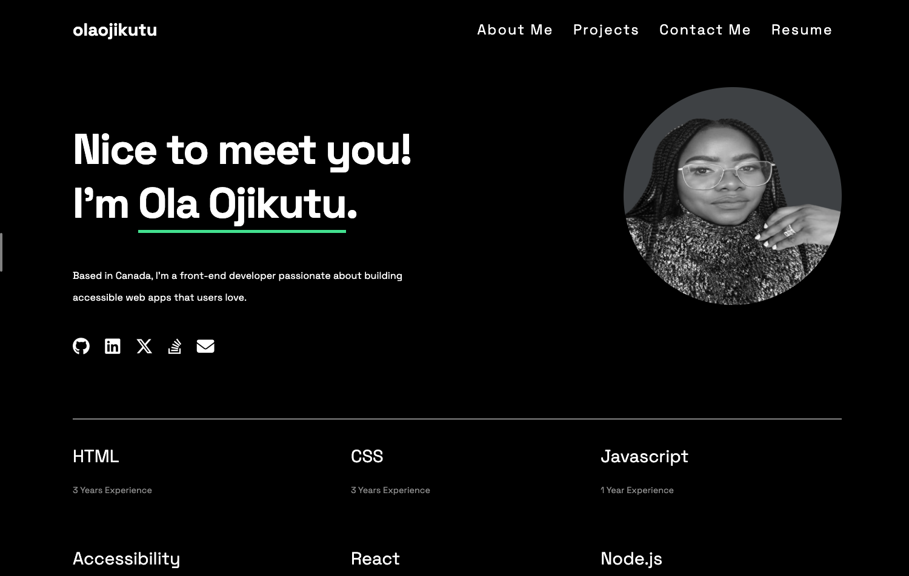
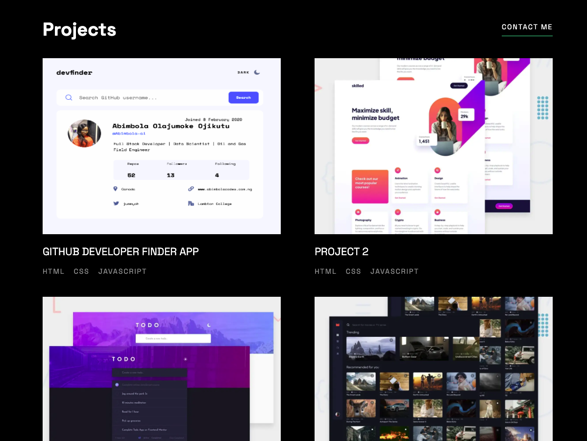
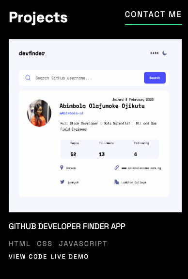

# dev-portfolio

This is a solution to a developer's portfolio build assignment from SkillHat. *[SkillHat](https://skillhat.ca/)* is the bridge between tech talent and industry needs.

## Table of contents

- [Overview](#overview)
  - [The challenge](#the-challenge)
  - [Screenshot](#screenshot)
  - [Links](#links)
- [My process](#my-process)
  - [Built with](#built-with)
  - [What I learned](#what-i-learned)
  - [Continued development](#continued-development)
  - [Useful resources](#useful-resources)
- [Author](#author)
- [Acknowledgments](#acknowledgments)

## Overview

### The challenge

The rebuilt portfolio page should demonstrate implementations of:

* Mobile Responsiveness (Media Queries);
* CSS Positioning and Layout;
* Utilization of Flexbox and/or CSS Grid
* CSS Variables
* The repository should also have a basic README.md document.

### Critical Requirements

* When the page is loaded the page presents your name, a recent photo or avatar, and links to sections about you, your work, and how to contact you.
* When one of the links in the navigation is clicked then the UI scrolls to the corresponding
  section
* When viewing the section about your work then the section contains titled images of your
  applications
* When presented with the your first application then that application's image should be larger in size than the others.
* When images of the applications are clicked then the user is taken to that deployed application.
* When the page is resized or viewed on various screens and devices then the layout is responsive and adapts to my viewport

### Screenshot

###### Desktop View/Tablet View

##### Mobile View

### Links

- Solution URL: https://github.com/Abimbola-ai/dev-portfolio
- Live Site URL: https://ola-developer-portfolio.netlify.app/

## My process

### Built with

- Semantic HTML5 markup
- CSS custom properties
- Flexbox
- CSS Grid

### What I learned

* Style for different viewport
* Use git to work, branch and commit to a project
* Comment effectively and write clean code.
* Use of flex and positioning in css

### Continued development

* Use of mobile first approach for faster and efficient development
* Modularize code especially css for easy debugging and reusability.

## Author

- LinkedIn - [ojikutu-olajumoke](https://www.https://www.linkedin.com/in/ojikutu-olajumoke/)

## Acknowledgments

A big thanks to SkillHat for providing a platform to challenge and enhance my abilities. Thanks also to my frontend instructor [Edward Apostol](https://www.linkedin.com/in/edwardapostol/ "Instructor")
